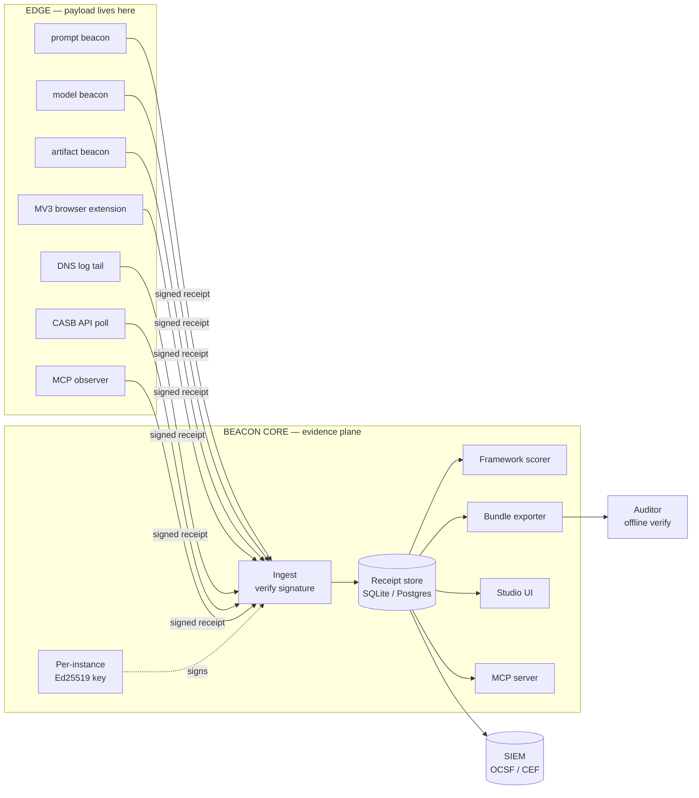

# ARCHITECTURE-BETA.md — AIGovOps Beacon

**Verifiable AI governance — Apache-2.0, no SaaS lock-in.**
Tagline: *YES-Ship AI · YES-Steady AI · YES-Recover AI.*

> *Hand the auditor a bundle they can verify themselves.*

| | |
|---|---|
| **Version** | 2.3 |
| **License** | Apache-2.0 |
| **Status** | Beta — production patterns documented, suitcase lab proven |
| **Owners** | bob.rapp@aigovops.community · ken.johnston@aigovops.community |
| **Foundation** | https://www.aigovopsfoundation.org/ |

---

## Contents

1. [Goals & non-goals](#1-goals--non-goals)
2. [The core conviction](#2-the-core-conviction)
3. [System diagram](#3-system-diagram)
4. [Three deployment shapes](#4-three-deployment-shapes)
5. [Data plane vs. evidence plane](#5-data-plane-vs-evidence-plane)
6. [Browser-session discovery (the hard part)](#6-browser-session-discovery-the-hard-part)
7. [MCP integration](#7-mcp-integration)
8. [Receipt format](#8-receipt-format)
9. [Threat model](#9-threat-model)
10. [Beta-to-ship transitions](#10-beta-to-ship-transitions)
11. [What this is not](#11-what-this-is-not)
12. [v2.3 — hosted MCP, restricted agent, offline walkthrough](#12-v23--hosted-mcp-restricted-agent-offline-walkthrough)

---

## 1. Goals & non-goals

### Goals

- Prove an AI decision happened, when, by whom, against which control, **without ever seeing the payload**.
- Run identically on a laptop (lab), in a corp DMZ (beta), and in HA production. One codebase, three envelopes.
- Discover AI usage that happens **outside the firewall** — on hotel Wi-Fi, on coffee-shop networks, on home networks — with no agent on the endpoint beyond a managed browser extension.
- Produce an auditor bundle that is verifiable offline by a third party with no access to the network it came from.
- Stay Apache-2.0. No SaaS lock-in. No phone-home.

### Non-goals

- We are not a DLP. We do not see content.
- We are not a SIEM. We forward to one.
- We are not a model-evaluation harness. We attest decisions, not quality.
- We are not a prompt firewall. We sit beside the LLM call, not in front of it.

---

## 2. The core conviction

**Evidence is not data.**

A traditional governance tool tries to see everything — every prompt, every output, every document — and applies policy to it. That stance creates four problems at once: privacy exposure, regulatory liability, payload-volume scaling, and vendor lock-in (because only their tool can interpret the payloads).

Beacon flips the stance. The collector at the edge sees the payload. It hashes it, signs the hash, and the only thing that leaves the edge is the **receipt**:

```
{ ts, source, host, content_hash, signature, schema_version }
```

The receipt is small (under 1 KB), signable, replayable, and **boring to a regulator**. Every property a governance system needs — non-repudiation, time-ordering, tamper evidence, framework mapping — is satisfied by the receipt alone. The payload never crosses a trust boundary.

This is the **evidence plane**. It is separate from, and much smaller than, the data plane.

---

## 3. System diagram

```
                     ┌──────────────────── EDGE ───────────────────────┐
                     │                                                 │
   user prompt ──▶   │  prompt beacon ─────signs────▶  receipt         │
   model call  ──▶   │  model  beacon ─────signs────▶  receipt         │
   artifact    ──▶   │  artifact beacon ───signs────▶  receipt         │
   browser tab ──▶   │  MV3 extension ─────signs────▶  receipt         │
   DNS query   ──▶   │  log tail ──────────signs────▶  receipt         │
   CASB event  ──▶   │  API poll ──────────signs────▶  receipt         │
   MCP call    ──▶   │  observer ──────────signs────▶  receipt         │
                     │                                                 │
                     │   payloads STAY HERE.  receipts LEAVE.          │
                     └─────────────────────────┬───────────────────────┘
                                               │
                                               ▼  HTTPS, mTLS optional
                     ┌──────────── BEACON CORE (evidence plane) ───────┐
                     │                                                 │
                     │   ingest ──▶ verify sig ──▶ store ──▶ Merkle    │
                     │                                                 │
                     │   query API · framework scoring · bundle export │
                     │                                                 │
                     │   ──▶ SIEM forwarder (OCSF / CEF)               │
                     │   ──▶ Studio (web UI)                           │
                     │   ──▶ MCP server (tools for agents)             │
                     │                                                 │
                     └─────────────────────────────────────────────────┘
```

### Mermaid (for repo rendering)



---

## 4. Three deployment shapes

| Shape | Compute | DB | Receipts at rest | Auth | SIEM | Cost/mo |
|---|---|---|---|---|---|---|
| **A. Suitcase Lab** | Laptop, Docker | SQLite | Local disk | None (localhost) | None | $0 |
| **B. Beta Corp** | 1 DMZ VM, Docker | SQLite (WAL) | Local disk + nightly S3 snapshot | OIDC | Optional | ~$120 |
| **C. Production** | HA pair, Docker on Render/DO/EKS | Postgres (HA) | S3 + KMS | OIDC + oauth2-proxy | Required (OCSF) | ~$800–$3500 |

Transitions are documented in [§10](#10-beta-to-ship-transitions).

---

## 5. Data plane vs. evidence plane

| | Data plane | Evidence plane |
|---|---|---|
| What's in it | Prompts, model outputs, documents, code, embeddings | Receipts: `{ts, source, host, hash, sig}` |
| Where it lives | At the edge — where the AI call happens | In Beacon core |
| Size | GB–TB/day | KB/day per source |
| Who can read it | Owner only | Auditor (with bundle) and Beacon admins |
| Crosses trust boundaries? | No, by design | Yes, intentionally |
| Regulatory scope | Maximum (PII, IP, confidential) | Minimal (hashes + timestamps + sigs) |

The separation is **the** architectural choice. Every other decision flows from it.

---

## 6. Browser-session discovery (the hard part)

A real corp AI footprint looks like this:

```
~40%   ChatGPT, Claude, Gemini, Copilot  — via browser
~25%   Internal copilots, Notion AI, Slack AI — via browser
~15%   IDE assistants (Cursor, Continue) — desktop apps
~10%   CLI tools (curl, scripts, gh copilot) — terminal
~10%   Server-side (Bedrock, Vertex, Azure OpenAI) — cloud
```

The hard 65% is **in the browser, on devices that often aren't on the corp network**.

### 6.1 Why net-level approaches alone fail

| Approach | Problem |
|---|---|
| SPAN port on egress | Misses traffic from a laptop on hotel Wi-Fi |
| Proxy log mining | Misses anything bypassing the proxy (most personal devices) |
| DNS log only | Misses devices using DoH (Firefox default, increasing in Chrome) |
| CASB only | Sees sanctioned + popular shadow IT, misses long-tail |
| Endpoint agent | Privacy/legal/perf objections, multi-quarter rollout |

### 6.2 The layered answer

Beacon stacks five layers. Beta deploys L1–L3 on day 1. L4 and L5 arrive after trust accrues.

```
┌────────────────────────────────────────────────────────┐
│ L1  Managed browser extension (MV3)                    │
│     Endpoint, in browser, on ANY network               │
│     ─────────────────────────────────────────          │
│     hostname-only, signed, hashed                      │
│     pushed via Chrome ExtensionInstallForcelist        │
│     and Intune/JAMF policies                           │
│                                                        │
│ L2  Corp DNS log tail                                  │
│     Read-only file watch on Infoblox/BIND/Windows DNS  │
│     Catches CLI tools, system services, scripts        │
│                                                        │
│ L3  CASB API poll                                      │
│     Netskope / Zscaler / Defender for Cloud Apps       │
│     User-attributed shadow IT discovery                │
│                                                        │
│ L4  eBPF probe                                         │
│     Opt-in dev fleet, sees TLS SNI for every TCP conn  │
│                                                        │
│ L5  VPC / cloud mirror                                 │
│     Server-side AI calls (Bedrock, Vertex, AOAI)       │
└────────────────────────────────────────────────────────┘
```

### 6.3 The MV3 extension specifically

This is the only honest answer to *"how do we see AI usage from a laptop on hotel Wi-Fi?"*

- **Permissions:** `tabs`, `storage`, `alarms` only. No `webRequest`, no `<all_urls>`. The extension cannot read your tabs' content.
- **What it captures:** `new URL(tab.url).hostname` on `tabs.onUpdated`. Hashed with a per-tenant salt before storage. The full URL never leaves the browser.
- **Allowlist:** A managed-storage policy (`storage.managed`) ships from MDM with the list of hostnames considered AI services. Only those domains generate a receipt; everything else is dropped at the source.
- **Transport:** HTTPS POST to `BEACON_PUBLIC_URL/ingest` with a per-install Ed25519 signature. mTLS optional for high-trust deployments.
- **Privacy posture:** No URLs, no page content, no user identifiers beyond a per-install opaque ID. The user can inspect their own outbound receipts via the extension popup.
- **MDM-installable:** Chrome `ExtensionInstallForcelist` + `ExtensionSettings`, Edge mirror, Intune ADMX, JAMF MCX. Safari MV3 support planned for v2.3.

This layer alone solves the *"AI usage outside the firewall"* problem, which is the question every CISO actually wants answered.

---

## 7. MCP integration

Beacon plays **two roles** in the MCP ecosystem.

### 7.1 Beacon as an MCP server

Agents (Claude Desktop, Cursor, Continue, Goose, Zed) connect to Beacon and gain six tools:

| Tool | Purpose |
|---|---|
| `record_decision` | Log a governance decision (approver, framework, controls, scope) and get back a receipt ID |
| `verify_receipt` | Given a receipt ID or hash, return signed verification + chain-of-custody |
| `query_inventory` | List discovered AI services, optionally filtered by source/window/risk |
| `score_framework` | Run a framework checklist (e.g., NIST AI RMF 1.0) and return current score + gaps |
| `bundle_for_auditor` | Produce a verifiable tarball for a date range + framework |
| `replay_case` | Replay one of the 100 historical failure cases against current controls |

Transports: **stdio** (Claude Desktop, Cursor) and **SSE** (web clients, future remote agents). Both run from the same `mcp/server.js` process.

Claude Desktop config snippet ships in `mcp/claude_desktop_config.json`:

```json
{
  "mcpServers": {
    "aigovops-beacon": {
      "command": "node",
      "args": ["/path/to/aigovops-beacon/mcp/server.js"],
      "env": { "BEACON_URL": "http://localhost:8787" }
    }
  }
}
```

### 7.2 Beacon as an MCP observer

Other MCP servers' `tools/call` invocations are themselves receiptable. The observer wraps an MCP server (e.g., a filesystem MCP server) and emits a signed receipt for each call, capturing:

- Server name and version
- Tool name
- Argument hash (not arguments themselves)
- Caller agent identity
- Return status

This is the audit story for MCP that **does not currently exist anywhere**. As agent-to-agent traffic over MCP grows, this layer becomes the *only* place where governance teams can see what agents are actually doing on their behalf.

---

## 8. Receipt format

Receipts are CBOR-encoded on the wire, JSON in storage and bundles.

```json
{
  "schema_version": "2.0",
  "ts": "2026-05-13T15:08:47.123Z",
  "source": "ext.chrome.v2.2.0",
  "host_hash": "sha256:9a3f...e1",
  "content_hash": "sha256:5b8c...4d",
  "subject": "user:opaque:7f2c...",
  "framework": "nist-ai-rmf-1.0",
  "control": "MAP-2.1",
  "decision": "observe",
  "counter": 481723,
  "prev_hash": "sha256:8e2a...",
  "sig": "ed25519:base64:..."
}
```

Properties:

- **`prev_hash`** chains receipts within a source — gaps are detectable.
- **`counter`** is a monotonic per-source counter — replays are detectable.
- **`sig`** is Ed25519 over the canonical CBOR encoding of all other fields.
- **`host_hash`** is `sha256(salt || hostname)`. The salt is per-tenant and never leaves Beacon core.
- Cleartext hostnames are stored *only* for an admin-curated allowlist of well-known AI services. Everything else is hash-only.

Bundles include the full receipt set, the per-source public keys, and a Merkle root signed by Beacon's instance key. A verifier with the bundle and the foundation's published root-of-trust can verify everything offline.

---

## 9. Threat model

### 9.1 STRIDE

| Threat | Vector | Mitigation |
|---|---|---|
| **S**poofing | Forged source identity | Per-source Ed25519 keypair; key enrollment via signed enrollment token from Beacon admin |
| **T**ampering | Receipt edited in store | Hash-chained receipts (`prev_hash`); Merkle root in bundles; SIEM forwarder gives independent copy |
| **R**epudiation | "I never approved that" | Receipts are signed by the recording source, not Beacon; ed25519 sigs survive forever |
| **I**nfo disclosure | Hostnames leak browsing | Hostnames hash-only by default; cleartext only for allowlisted AI services |
| **D**oS | Receipt flood | Per-source token bucket (default 50/sec); drops emit a "drop receipt" so loss is observable |
| **E**oP | Compromised Beacon node | Receipts forwarded to SIEM in near-real-time; tampering detected on next bundle verify |

### 9.2 Specific scenarios

| Scenario | Outcome |
|---|---|
| Attacker installs malicious extension on a managed laptop | MDM-enforced manifest hash check rejects it; force-install policy reinstalls real extension |
| Attacker drops Beacon DB and replaces it | SIEM has an independent copy; bundle verify against last good Merkle root flags it |
| Attacker gets root on Beacon VM | Past receipts already in SIEM; signing key is KMS-backed in prod and rotated on detection |
| User disables corp DNS via DoH | Browser extension still reports (different layer); CASB still reports (different layer) |
| User uninstalls extension | MDM event triggers a receipt; reinstall is automatic; gap is visible in Studio |
| Network is partitioned | Extension buffers up to 10k receipts locally; ships when reconnected; gap is visible in `counter` |

### 9.3 What we do *not* defend against

- A user with admin rights on their personal device deciding never to use a managed browser. (Policy problem, not engineering.)
- A foreign nation-state with physical access to the Beacon VM. (Out of scope for v2.x.)
- Receipt-flood attacks that exhaust SIEM ingest budget. (Customer's SIEM contract problem; we emit drop receipts.)

---

## 10. Beta-to-ship transitions

```
Suitcase Lab                Beta Corp                  Production
─────────────               ─────────                  ──────────
SQLite file        ───▶     SQLite + S3 snapshot ───▶  Postgres HA
No auth            ───▶     OIDC (Okta/Entra)    ───▶  OIDC + oauth2-proxy + WAF
Local signing key  ───▶     Local key, backed up ───▶  KMS-backed signer
No SIEM            ───▶     Optional Splunk fwd  ───▶  Required OCSF forwarder
1 container        ───▶     5 containers        ───▶  HA pair behind LB
Synth-traffic only ───▶     DNS tail + CASB     ───▶  +eBPF (opt-in) +VPC mirror
```

**Critically**, the receipt format is identical across all three. A lab receipt and a production receipt are bit-for-bit compatible. You can carry `receipts.db` from beta into production as the seed corpus — no migration.

---

## 11. What this is not

- **Not a model-evaluation harness.** We attest that a decision was made, not whether the model was good. (Eval lives upstream; receipts about evals are welcome.)
- **Not a prompt firewall.** Sit beside the LLM call, not in front of it. Other tools front-run prompts; we trail them with evidence.
- **Not a SaaS.** Apache-2.0. No phone-home. Your bundles never leave you.
- **Not a replacement for a SIEM.** We forward to one.
- **Not a replacement for IAM, MDM, CASB, or DLP.** We sit *alongside* them and consume their signals.

---

## Appendix A — Repository map (v2.2)

```
aigovops-beacon/
├── ARCHITECTURE.md             # Original architecture (v2)
├── ARCHITECTURE-BETA.md        # THIS FILE
├── LAB.md                      # Workshop playbook
├── README.md
├── CONTRIBUTING.md
├── beacons/                    # prompt, model, artifact (Python)
├── server/                     # Beacon core + Studio (Node)
├── mcp/                        # MCP server (stdio + SSE)
│   ├── server.js
│   ├── tools/
│   ├── claude_desktop_config.json
│   └── README.md
├── extension/                  # MV3 browser extension (Chrome+Edge)
│   ├── manifest.json
│   ├── background.js
│   ├── popup.html, popup.js
│   ├── managed_schema.json
│   └── README.md
├── scripts/
│   ├── synth-traffic.py        # Replays 100-case dataset as DNS/SNI
│   └── tail_dns.py             # File-watch DNS log → Beacon
├── deploy/
│   ├── lab.yml                 # Suitcase Lab docker-compose
│   ├── beta.yml                # Beta Corp docker-compose
│   ├── render.yaml             # Production on Render
│   ├── do-app.yaml             # Production on DigitalOcean
│   └── README.md
├── frameworks/                 # 23-framework registry
├── checklists/                 # Per-framework control checklists
├── scoring/                    # Framework scoring engine
├── docs/                       # GitHub Pages site
│   └── data/ai_failures_top100.json
└── tests/
    └── e2e.py                  # 91-link liveness harness
```

---

## 12. v2.3 — hosted MCP, restricted agent, offline walkthrough

Three additions in v2.3, all aimed at the same problem: **make Beacon
runnable as a demo on someone else's network, and as a substrate under
an autonomous agent that needs to ship into procurement.**

### 12.1 Hosted MCP server (`mcp-public/`)

A single Node process that boots:

- The Beacon core on loopback `127.0.0.1:$BEACON_PORT`.
- The MCP-SSE server (`/sse`, `/messages?sid=...`) on the public `$PORT`.
- A synchronous JSON-RPC fallback at `POST /rpc` so Workers (which do
  poorly with long-lived SSE) can drive the same six tools.
- A read-only proxy at `/api/v1/*` so a browser can sanity-check the
  embedded Beacon. Writes are 405 in `PUBLIC_MODE=1` — the only way to
  produce a receipt is through MCP.

Deploys to Render free tier from `mcp-public/render.yaml`. A Dockerfile
is included for any other host that accepts containers. The dyno disk is
ephemeral; receipts live for the dyno's lifetime. This is the **demo /
wire-protocol playground**, not the evidence store — for evidence,
still run the suitcase variant (§4, Lab 1–7).

### 12.2 Restricted Cloudflare Worker agent (`agent/`)

A Worker whose tool universe is **enforced** to be exactly the names
returned by the hosted MCP's `tools/list`. Two layers:

1. System prompt explicitly names the six tools and forbids invention.
2. Worker code rejects any `tool_use` whose name is not in the
   `allowedNames` set and feeds the model a `REFUSED:` result.

The Worker is BYO-key: users paste an Anthropic or OpenAI key in the UI;
the Worker forwards it on each request and forgets it. No model contract,
no key storage, no SaaS dependency for the demo.

Agent loop is bounded — `MAX_HOPS=6` tool/use→tool/result cycles before
the agent returns. Every accepted call goes through Beacon and produces
a signed receipt. Every refused call is recorded too (see
[SUPERAGENT.md](./SUPERAGENT.md)).

### 12.3 Offline interactive walkthrough (`docs/walkthrough/`)

A twelve-step animated walkthrough of the full Beacon flow, fully
self-contained — no CDN, no fonts, no network. Same Hydra Teal palette
as the rest of the system. Designed to run from a USB stick at an event
with no Wi-Fi.

A ~70-second MP4 fallback ([`docs/downloads/beacon-walkthrough.mp4`](./docs/downloads/beacon-walkthrough.mp4))
is included for environments where opening HTML is awkward (locked-down
kiosks, embedded video in slide decks).

The walkthrough is the **canonical 5-minute explanation** of Beacon.
When you don't have time to install a suitcase, you have time for this.

### 12.4 Three verified deployment shapes (`DEMOS.md`)

Not new shapes — the same three from §4 (suitcase, lab-on-corp, beta
hybrid) — but [`DEMOS.md`](./DEMOS.md) contains the live, captured
output of running each one end-to-end, with real inventory counts,
receipt ids, signature fingerprints, and bundle manifests. Reproducible
from a fresh checkout in ~5 minutes.

### 12.5 Diagram

```
    user / agent / auditor
           │
           ▼  (HTTPS)
    ┌───────────────────────────────────┐
    │  Cloudflare Worker (agent/)         │        ← BYO LLM key
    │  six tools, refusal on anything else│
    └──────────────┬─────────────────┘
                       │  /rpc  /sse
                       ▼
    ┌───────────────────────────────────┐
    │  Render dyno  (mcp-public/)         │
    │   ─ MCP-SSE  + JSON-RPC fallback    │
    │   ─ embedded Beacon on loopback      │
    │   ─ read-only /api/v1/* proxy        │
    └───────────────────────────────────┘
```

This is **the demo posture**, not the production posture. For
production, the orchestration runs *at the client site*, Beacon
runs *at the client site*, and the Worker pattern collapses into
whatever orchestrator the client uses (LangGraph, Vercel AI, raw
function-calling). The point is the **enforcement model** — closed
tool universe, refused on miss, signed on accept — not the specific
hosting choice.

---

## Appendix B — Cited reference cases

The 100-case dataset at `docs/data/ai_failures_top100.json` is the regression set. Every receipt-emission test must classify each case correctly as YES-Ship / YES-Steady / YES-Recover.

The classifier and the receipts are coupled — a regression in either is visible in `tests/e2e.py`.

---

*Document maintained at [github.com/bobrapp/aigovops-beacon](https://github.com/bobrapp/aigovops-beacon). Pull requests welcome. Apache-2.0.*
