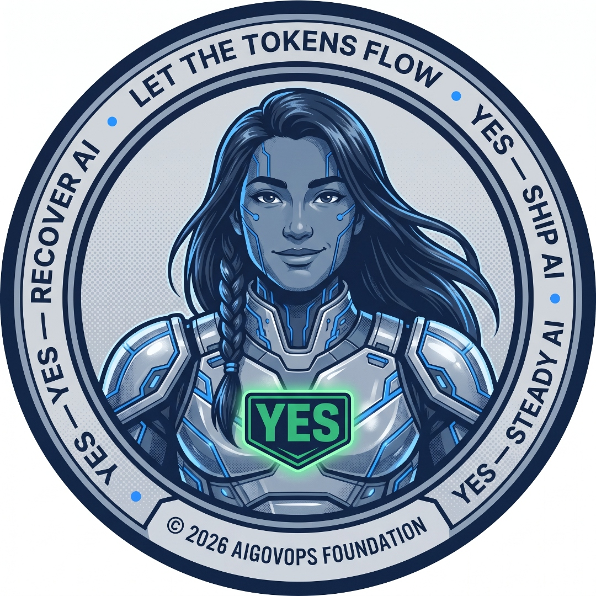

<p align="center">
  
</p>

<h1 align="center">AiGovOps Beacon</h1>

<p align="center">
  <strong>From shadow AI to verifiable evidence — in one afternoon.</strong><br/>
  An <a href="https://www.aigovopsfoundation.org/">AiGovOps Foundation</a> project, implementing the <a href="https://overt.is/">OVERT 1.0 open standard</a>.<br/>
  Standard steward: <a href="https://www.glacis.io/">Glacis Technologies</a> · Foundation Founding Steward Partner.<br/>
  <em>Beacon is an OVERT 1.0–conformant runtime that produces signed, verifiable receipts of every AI decision. It runs alone.</em>
</p>

<p align="center">
  
  
  
  
  
  
</p>

---

## Standards alignment

Beacon implements the [**OVERT 1.0 open standard**](https://overt.is/) for observable verification evidence at the AI runtime boundary, stewarded by [Glacis Technologies, Inc](https://www.glacis.io/). Beacon is being registered as an OVERT Protocol Profile under the royalty-free patent covenant published at [overt.is/ipr-policy](https://overt.is/ipr-policy).

| | |
|---|---|
| **Standard** | OVERT 1.0 (Glacis Technologies, 25 March 2026) |
| **Profile** | `aigovops-beacon.v1` — registration in progress, see [`docs/PROFILE_REGISTRATION.md`](docs/PROFILE_REGISTRATION.md) |
| **Target conformance** | AAL-1 (self-declared) at registration · AAL-2 with IAP on roadmap |
| **Patent covenant** | Royalty-free under [overt.is/ipr-policy](https://overt.is/ipr-policy) |
| **Crosswalk** | [`crosswalks/overt-mapping.yaml`](crosswalks/overt-mapping.yaml) — Beacon controls → OVERT six domains |

The AiGovOps Foundation does **not** issue standards. We implement, adopt, teach, and build community around them. See [`STANDARDS.md`](STANDARDS.md), [`GOVERNANCE.md`](GOVERNANCE.md), and [`STEWARD.md`](STEWARD.md).

---

## Try it in the browser — no install

The project's home page **is** a self-running demo: it generates an Ed25519 key, discovers a sample inventory, signs each receipt with canonical JCS (RFC 8785), and assembles a real downloadable evidence bundle — all client-side, no server.

**Live site (GitHub Pages):** [https://aigovops-foundation.github.io/aigovops-beacon/](https://aigovops-foundation.github.io/aigovops-beacon/)

The page also hosts:

- The full **audit framework PDF** (NIST AI RMF + EU AI Act Art. 13 + ISO/IEC 42001 + HIPAA + Human Flourishing)
- The five individual checklist PDFs and the [Excel inventory template](docs/downloads/AI_Model_Inventory_Template.xlsx)
- The [starter .zip](docs/downloads/aigovops-beacon-starter.zip) for the entire repo
- One-click deploy recipes for Railway, Render, and DigitalOcean App Platform

Want to read the home-page source? It's plain HTML + CSS + JS in [`docs/`](docs/).

---

## Why Beacon exists

Most AI governance today is a PDF and a meeting. That's not governance — that's aspiration.

**Beacon is the simplest possible answer to one question your auditor actually asks:**

> *"What AI models are running on our network — who is using them, with what version, against what data, and where is the evidence?"*

It answers that question in two ways at the same time:

1. **Beacon Studio** — a five-step, sticky-notes-friendly wizard. A governance lead with zero terminal experience walks in cold and walks out with a signed checklist, an evidence trail, and a pull request that turns the checklist into policy-as-code.
2. **Beacon Control Plane** — the same data, exposed as a power-user dashboard. Filters, raw event stream, OPA/Rego console, SIEM export. Same backend. Same evidence. Toggle in the top right.

One engine. Two front doors. Zero PDF theater.

---

## What ships in the box

| Layer | What it does |
|---|---|
| **Discovery** | Detects AI usage across your network via passive DNS/HTTP scan, outbound proxy hooks, cloud account scans (AWS Bedrock, Azure OpenAI, Vertex, Databricks), CSV import, and an optional endpoint agent. |
| **Inventory** | Every detection becomes a row: vendor · model · version · occurrence count · users · first seen · last seen · environment · evidence pointer. |
| **Transaction tracking** | Every observed interaction becomes a [Replay-style receipt](docs/RECEIPT_SCHEMA.md): logged-in user · UTC timestamp · model · version · prompt (or hash) · result (or hash) · Ed25519 signature. Append-only NDJSON. Merkle root anchored hourly. |
| **Checklists** | Pre-built packs: NIST AI RMF, EU AI Act Article 13, ISO/IEC 42001, HIPAA-for-AI, and the Foundation's [Human Flourishing Gate](policy/gate.human-flourishing.v1.yaml). Auditor checks what applies. |
| **Policy as Code** | One button emits a `gate.<org>.yaml` + OPA `.rego` + Governance Decision Record + signed bundle. Opens a PR against your governance repo. |
| **Two front doors** | [`/studio`](docs/STUDIO_FLOW.md) for the workshop, [`/control`](docs/CONTROL_PLANE.md) for the power user. |

---

## Quickstart — five minutes, three commands

> **Corrected 2026-07-20.** Both commands here were wrong. The Docker option pulled
> `ghcr.io/bobrapp/aigovops-beacon:latest`, which is not pullable — the repo moved to the
> `aigovops-foundation` org and no public image was ever pushed. The local option ran
> `npm install` at the repo root, where there is no `package.json`; the Node project lives in
> `server/`. A quickstart that fails on its first command is worse than no quickstart.

```bash
# Local — this is the path that works today
git clone https://github.com/aigovops-foundation/aigovops-beacon
cd aigovops-beacon/server
npm install
npm run init          # first run only: creates the local store
npm run dev           # http://localhost:8787
```

(The old text said port 8080. The default in `server/src/lib/config.js` is **8787** — so even
the port in the broken quickstart was wrong. Verified by reading the config, not by assuming.)

A published container image is not available yet. When one is, it will be pushed to
`ghcr.io/aigovops-foundation/aigovops-beacon` and documented here — not before.

Open http://localhost:8787. Studio opens by default. Click the toggle in the top right for the Control Plane.

Four more one-click deploys live in [`/deploy`](deploy/): Railway, Render, DigitalOcean App Platform, and Docker Compose.

---

## The five-step Studio (workshop mode)

This is what a non-technical auditor sees. No terminal. No YAML. No jargon.

| Step | Title | Auditor sees |
|---|---|---|
| 1 | *What network are we looking at?* | "Paste a domain, upload a CSV, or connect a cloud account. Beacon will look for AI models running there." |
| 2 | *Beacon is looking…* | Live tile board of every model detected. Vendor logo, name, version, count, last-seen, environment. Updates in real time. |
| 3 | *Pick what matters.* | Tap rows that are in scope. Beacon explains each in plain English ("This is OpenAI's GPT-4o, used 1,840 times this week by 12 people in your support team."). |
| 4 | *Pick your guardrails.* | Cards for NIST RMF, EU AI Act, ISO 42001, HIPAA-for-AI, Human Flourishing. Auditor checks the ones that apply. |
| 5 | *Here's your audit.* | One screen: traffic-light checklist, the receipts behind each green check, and a **Make it Policy as Code** button. |

Full spec, copy, and accessibility notes in [`docs/STUDIO_FLOW.md`](docs/STUDIO_FLOW.md). Workshop facilitator guide in [`docs/AUDITOR_WORKSHOP.md`](docs/AUDITOR_WORKSHOP.md).

---

## Operating thesis

This repo dogfoods the Foundation's operating thesis:

> **Agents do the bureaucracy; humans hold the meaning — and humans hold the keys.**

Beacon will *draft* anything — the inventory, the checklist mapping, the policy YAML, the GDR, the PR description. But every human-decision gate stays a human-decision gate: scope ratification, exception grants, trust-tier promotion, and policy publication all require a named human approver. The receipt records who approved what, when, and with which key.

---

## The four pillars, made tangible

| # | Pillar | How Beacon delivers it |
|---|---|---|
| 01 | **Governance as Code** | Every checklist exports to versioned YAML + Rego. The Studio's final button is literally `git push`. |
| 02 | **AI Technical Debt Elimination** | Discovery surfaces every model your org didn't know was running. Un-receipted activity is technical debt — visible, countable, closeable. |
| 03 | **Operational Compliance** | Receipts are Ed25519-signed and Merkle-anchored. Compliance becomes a query, not a quarterly scramble. |
| 04 | **Community-Driven Standards** | Checklist packs are plain YAML. Fork, edit, PR. The community owns the controls. |

---

## How it talks to the rest of the AiGovOps stack

Beacon doesn't replace anything — it sits *upstream* of the other Foundation projects and feeds them:

```
   ┌───────────────────────────┐
   │   AiGovOps Beacon         │  ← you are here
   │   (discovery + studio)    │
   └────────────┬──────────────┘
                │ signed receipts + checklist bundle
                ▼
   ┌───────────────────────────┐    ┌─────────────────────────┐
   │  aigovops-Replay          │    │  aigovops-foundation-os │
   │  (receipt verification)   │    │  (policy + GDR schemas) │
   └────────────┬──────────────┘    └────────────┬────────────┘
                │                                │
                ▼                                ▼
   ┌───────────────────────────┐    ┌─────────────────────────┐
   │  webhook-sentinel         │    │  aigovops-prompt-studio │
   │  (PR-review trust)        │    │  (prompt-level audit)   │
   └───────────────────────────┘    └─────────────────────────┘
```

Receipt schema is wire-compatible with [`aigovops-Replay`](https://github.com/bobrapp/aigovops-Replay). Gate schema is wire-compatible with [`aigovops-foundation-os`](https://github.com/bobrapp/aigovops-foundation-os).

For the broader Foundation context — sister projects, the umbrella policy-as-code companion, and how Beacon relates to other compliance tooling — see [`RELATED.md`](RELATED.md). Beacon does not require any of those projects.

---

## Performance

Beacon is fast enough that you'll never be tempted to disable it under load. On commodity x86_64 hardware:

- **9,000+ receipts/sec** signed by a single process
- **84 µs p50** inline overhead per AI call (canonicalize + sign)
- **8,000+ verifies/sec** for stream verification

Full methodology, capacity-planning numbers, and a reproducible benchmark script in [`BENCHMARKS.md`](BENCHMARKS.md).

---

## Testing

Beacon ships a full test pyramid across both runtimes — the Node/Express server
and the Python beacons/SDK. Tests are deterministic: anything random or
fuzz-driven is seeded, with an environment-variable override for local
exploration.

| Layer | What it checks | Node | Python |
| --- | --- | --- | --- |
| **Unit** | Pure functions: canonicalization, signing/verify, receipt building | `npm test` (in `server/`) | `pytest tests/unit` |
| **E2E** | Live routes answer and responses conform to the receipt schema | `npm run test:e2e` | `pytest tests/e2e` |
| **Chaos** | Fuzzed/malformed input + injected I/O faults never crash the server | `npm run test:chaos` | `pytest tests/chaos` |
| **Scale** | 10k+ receipts signed/bundled within a time & memory budget (gated) | — | `pytest -m scale tests/scale` |

```bash
# Node server tests (unit + E2E + chaos via auto-discovery)
cd server && npm install && npm test

# Python tests (unit + E2E + chaos; scale is excluded by default)
pip install -e ".[dev]"
python3 -m pytest                       # everything except scale
python3 -m pytest -m scale tests/scale  # the heavy scale layer, on demand
```

Determinism knobs: `CHAOS_SEED` / `CHAOS_RUNS` (Node), `HYPOTHESIS_SEED` /
`CHAOS_MAX_EXAMPLES` (Python), and `SCALE_COUNT` / `SCALE_TIME_BUDGET` /
`SCALE_MEM_BUDGET` / `SCALE_SEED` (scale). See
[`CONTRIBUTING.md`](CONTRIBUTING.md) for what each layer expects from a new PR.

---

## API

The complete HTTP API is documented under [`docs/api/`](docs/api/):

- **[`openapi.yaml`](docs/api/openapi.yaml)** — OpenAPI 3.1 spec for every
  endpoint: methods, paths, request/response schemas (success and error),
  auth, and idempotency notes.
- **[`flows.md`](docs/api/flows.md)** — how a receipt travels the system:
  creation → signing → bundle assembly → anchoring → consumption by Lantern,
  with Mermaid sequence diagrams.
- **[`actions.md`](docs/api/actions.md)** — every action verb (`gate.evaluated`,
  `bundle.signed`, `admission.allowed`, `inference.observed`, …) with semantics,
  required fields, and examples.

---

## Repository map

```
aigovops-beacon/
├── README.md                      ← you are here
├── LICENSE                        ← Apache-2.0
├── CONTRIBUTING.md
├── CODE_OF_CONDUCT.md
│
├── docs/
│   ├── STUDIO_FLOW.md             ← five-step wizard spec
│   ├── CONTROL_PLANE.md           ← advanced-mode reference
│   ├── ARCHITECTURE.md            ← discovery → receipts → policy pipeline
│   ├── RECEIPT_SCHEMA.md          ← Ed25519 transaction-record spec
│   └── AUDITOR_WORKSHOP.md        ← 90-minute facilitator guide
│
├── checklists/                    ← starter audit packs (YAML)
│   ├── nist-ai-rmf.v1.yaml
│   ├── eu-ai-act-art13.v1.yaml
│   ├── iso-iec-42001.v1.yaml
│   └── hipaa-for-ai.v1.yaml
│
├── policy/                        ← outputs the Studio emits
│   ├── gate.beacon.v1.yaml
│   ├── gate.human-flourishing.v1.yaml
│   └── rego/
│       ├── production_readiness.rego
│       └── transaction_signing.rego
│
├── server/                        ← Node/Express engine
│   ├── package.json
│   └── src/
│       ├── index.js
│       ├── routes/                  ← /discover /receipts /checklist /export
│       ├── services/                ← discovery, signing, checklist
│       └── lib/                     ← Ed25519, merkle, ndjson
│
├── studio/                        ← React/Vite five-step wizard
│   ├── package.json
│   └── src/
│       ├── App.jsx
│       ├── pages/                   ← Step01..Step05, Control
│       └── components/
│
├── deploy/
│   ├── Dockerfile
│   ├── docker-compose.yml
│   ├── railway.json
│   ├── render.yaml
│   └── do-app.yaml
│
└── scripts/
    ├── verify-receipt.js
    └── seed-demo.js
```

---

## License & community

- **License:** Apache-2.0 — same as `aigovops-foundation-os`.
- **Code of Conduct:** Contributor Covenant v2.1.
- **Community:** [AiGovOps Foundation](https://www.aigovopsfoundation.org/). Founders: [Ken Johnston](https://www.linkedin.com/in/rkjohnston) and [Bob Rapp](https://www.linkedin.com/in/bobrapp).

> *"Governance that ships with the code, not after."*  — Bob Rapp

> *"Shadow AI to verifiable evidence."*  — Ken Johnston
---

## Contact & community

**Tagline:** YES-Ship AI · YES-Steady AI · YES-Recover AI

- Bob Rapp — [bob.rapp@aigovops.community](mailto:bob.rapp@aigovops.community)
- Ken Johnston — [ken.johnston@aigovops.community](mailto:ken.johnston@aigovops.community)
- Foundation — [aigovopsfoundation.org](https://www.aigovopsfoundation.org/)

*Verifiable AI governance — Apache-2.0, no SaaS lock-in.*

## Related Foundation work

- [Redwood v2 (draft FEP)](https://github.com/aigovops-foundation/Redwood-Draft-June-2026) — Foundation Enhancement Proposal currently in WG bootstrap. Tracks ratification of receipt schemas, UCID registry, and viability lens (Ashby + Beer + sociotechnical). See the [ratification project](https://github.com/orgs/aigovops-foundation/projects/1) and [v0.1.0-draft release](https://github.com/aigovops-foundation/Redwood-Draft-June-2026/releases/tag/v0.1.0-draft).
