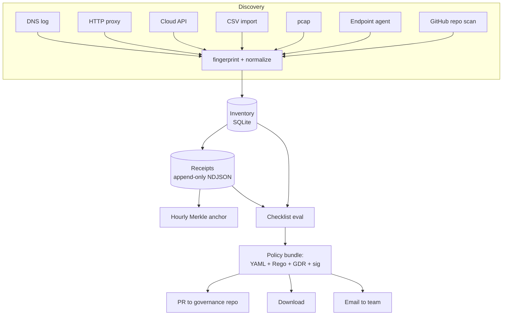

# Architecture

Beacon is a single Node process plus a SQLite file plus a directory of append-only NDJSON logs. That's it. Everything else is a deployment choice.

## High-level pipeline

```
┌──────────────────────────────────────────────────────────────────┐
│                         DISCOVERY                                │
│                                                                  │
│   [ DNS log ]   [ HTTP proxy ]   [ Cloud API ]   [ CSV ]         │
│   [ pcap ]      [ Endpoint agent ]   [ GitHub repo scan ]        │
│        │             │                  │           │            │
│        └─────────────┴──────────────────┴───────────┘            │
│                            │                                     │
│                            ▼                                     │
│                  +-------------------+                           │
│                  |  fingerprint +    |                           │
│                  |  normalize        |                           │
│                  +-------------------+                           │
└────────────────────────────┬─────────────────────────────────────┘
                             │
                             ▼
┌──────────────────────────────────────────────────────────────────┐
│                         INVENTORY                                │
│                                                                  │
│   one row per (vendor, model, version, environment)              │
│   each row: counts, users, first/last seen, evidence pointers    │
└────────────────────────────┬─────────────────────────────────────┘
                             │
                             ▼
┌──────────────────────────────────────────────────────────────────┐
│                       TRANSACTION TRACKING                       │
│                                                                  │
│   every inference observed → one signed receipt (NDJSON)         │
│   fields: user, ts_utc, vendor, model, version, prompt|hash,     │
│           result|hash, signature (Ed25519)                       │
│   hourly Merkle anchor → S3 / IPFS / local file                  │
└────────────────────────────┬─────────────────────────────────────┘
                             │
                             ▼
┌──────────────────────────────────────────────────────────────────┐
│                          CHECKLISTS                              │
│                                                                  │
│   pack YAML × inventory × receipts → pass / review / blocked     │
│                                                                  │
│   packs: NIST RMF · EU AI Act · ISO 42001 · HIPAA · Flourishing  │
└────────────────────────────┬─────────────────────────────────────┘
                             │
                             ▼
┌──────────────────────────────────────────────────────────────────┐
│                       POLICY AS CODE                             │
│                                                                  │
│   emit:  gate.<org>.v1.yaml                                      │
│          <org>_audit.rego                                        │
│          GDR-0001-<slug>.md                                      │
│          bundle.tar.gz + bundle.sig                              │
│                                                                  │
│   deliver: download · PR to GitHub · email                       │
└──────────────────────────────────────────────────────────────────┘
```

## Mermaid version



## Components, in code terms

| Component | Path | Notes |
|---|---|---|
| **HTTP server** | `server/src/index.js` | Express. One process. |
| **Discovery service** | `server/src/services/discovery.js` | Pluggable sources. Each implements `scan() → AsyncIterable<Detection>`. |
| **Signing** | `server/src/lib/sign.js` | Ed25519 via `tweetnacl`. Keys in `~/.beacon/keys/` (700). |
| **Receipt writer** | `server/src/lib/receipts.js` | Append-only NDJSON. `fsync` after each write. |
| **Merkle anchor** | `server/src/lib/anchor.js` | Hourly. SHA-256 tree. Roots written to `anchors.ndjson`. |
| **Checklist runner** | `server/src/services/checklist.js` | Pure function: `(packYaml, inventory, receipts) → results[]`. |
| **Policy emitter** | `server/src/services/policy.js` | Template-driven. Emits matched-pair YAML + Rego. |
| **Studio** | `studio/` | Vite + React. Talks to the API at `/api/v1`. |
| **Control Plane** | `studio/` (different route) | Same bundle. Toggle via `localStorage.beaconMode`. |

## Data layout on disk

```
~/.beacon/
├── beacon.sqlite               ← inventory, users, scoped settings
├── keys/
│   ├── signing.ed25519.pub
│   └── signing.ed25519.sec     ← 600, never logged
├── receipts/
│   ├── 2026-05-13.ndjson       ← daily file
│   ├── 2026-05-12.ndjson
│   └── anchors.ndjson          ← hourly Merkle roots
└── bundles/
    └── 2026-05-13_audit.tar.gz
```

## Why SQLite + NDJSON, not a "real" database

- **No cluster, no migration drama.** A non-technical user must be able to back up their evidence by `cp -r ~/.beacon /backup`.
- **Append-only NDJSON for receipts** is the simplest possible audit-friendly format. `grep` is a perfectly valid query engine for a year of receipts.
- **SQLite handles the relational shape** (inventory, users, packs) without operational tax.
- **Postgres is supported** for multi-node deployments. Same schema.

## Deployment shapes

| Shape | When to use | Files |
|---|---|---|
| **Local laptop** | Workshops, demos, single auditor | `npm run dev` |
| **Single VM (Docker)** | Small org, single tenant | `deploy/Dockerfile` |
| **Docker Compose** | Add Postgres, optional reverse proxy | `deploy/docker-compose.yml` |
| **Railway one-click** | Hosted, persistent volume | `deploy/railway.json` |
| **Fly.io** | Edge, multi-region | `deploy/fly.toml` |
| **Kubernetes** | Large enterprise | `deploy/k8s/` *(coming in v0.3)* |

## Trust model

- **Signing key** is generated on first run. Operator is shown the public-key fingerprint and asked to record it somewhere safe.
- **Verification is offline.** Anyone with the public key can verify any receipt without contacting Beacon.
- **Compromise recovery:** rotate the key (requires dual-control). All future receipts are signed by the new key; a `key.rotated` receipt links old and new. The signing log is also Merkle-anchored, so any attempt to forge backdated receipts is detectable.

## Limits and explicit non-goals

- **Beacon does not inspect prompt content by default.** It records hashes. Operators can opt in to capture (with the auditor's explicit consent receipt), and a redaction pass is run before storage.
- **Beacon does not block inference traffic.** It observes. A separate proxy or gateway can enforce — Beacon's policy bundle is the input.
- **Beacon does not replace your SIEM.** It forwards to it.
- **Beacon does not interpret regulation for you.** It runs the controls you (or the community) author.
