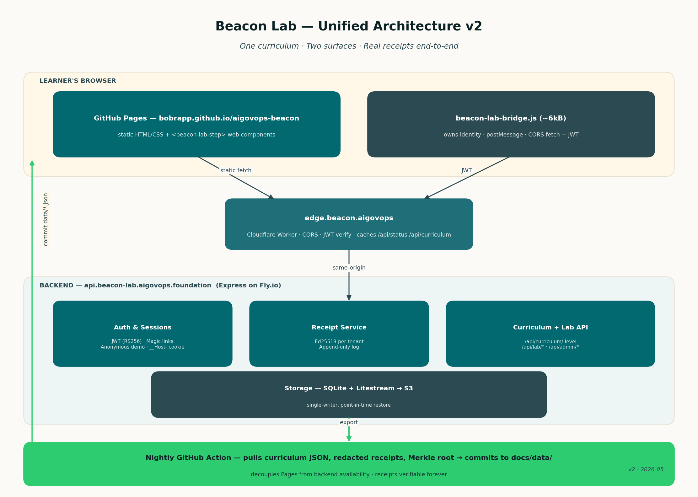

# Beacon Lab — Unified Architecture v2

**Status:** Proposal · 2026-05-23
**Author:** bob rapp + Computer
**Supersedes:** the implicit "two-app split" we have today (static `docs/lab*.html` on GitHub Pages, plus the Express/React lab service at `aigovops-beacon-lab.pplx.app`)

---

## 1. Problem statement

We currently ship the auditor lab as two disconnected products:

| Surface | URL | What it is | What it can't do |
|---|---|---|---|
| **Static lab** | `aigovops-foundation.github.io/aigovops-beacon/lab.html` (+ `lab-100.html`, `lab-200.html`) | Vanilla HTML/JS, `tweetnacl` in-browser, localStorage progress | No shared receipts, no admin oversight, signing is play-money, no audit trail across users, no resume across devices |
| **Live lab service** | `aigovops-beacon-lab.pplx.app` | Express + React + SQLite, real Ed25519 per tenant, real receipts, admin console, magic links | Hidden behind login + a `pplx.app` URL the public can't index; no SEO; one tab loses progress if the bundle hash rolls |

The bridge between them is a markdown tutorial. That's not architecture, that's a hyperlink.

The deeper issues:

- **No shared identity.** A learner who finishes Lab 100 on Pages has no token, no profile, no receipt that the live service recognizes.
- **No shared progress.** Their localStorage and the server's SQLite never meet.
- **No real proof.** Browser-side `tweetnacl` signatures aren't anchored to anything — keys are ephemeral, no one else verifies them, the receipts vanish on cache clear.
- **No upstream feedback.** The live service collects signal (which controls trip, which tenants succeed, common failure modes) that should inform the public curriculum, but never makes it back to Pages.
- **Operational drift.** Tonight alone we hit three bugs that all trace to the split: cookie stripping at the proxy, stale-bundle reloads, no SSO between surfaces. Each fix patched a symptom.

We need a real architecture, not another patch.

---

## 2. Design goals

In priority order:

1. **One curriculum, two surfaces** — Pages stays the discoverable front door, the lab service stays the source of truth. Don't merge them; sync them.
2. **Real receipts from minute one** — even Lab 100 step 1 should produce a server-anchored Ed25519 receipt the learner can verify later, with their email.
3. **No login friction for the first 10 minutes** — anonymous demo session that promotes to a real account when the learner is ready.
4. **Same-origin where it matters, federated where it doesn't** — keep auth cookies on the lab service domain; let Pages embed the lab surgically (web components + postMessage) without inheriting cross-origin cookie pain.
5. **Single source of truth for content** — Lab 100/200 step definitions, rules, and rubric live in `lab-service/shared/` and are rendered by both surfaces from the same JSON.
6. **Auditable end-to-end** — every action across both surfaces lands in the same append-only receipt log, signed by the tenant key.
7. **Operable by one person** — no Kafka, no microservices, no k8s. SQLite + a single Node process + GitHub Pages + a CDN edge worker is the limit.

---

## 3. Target architecture (one picture)



```
┌────────────────────────────────────────────────────────────────────────────┐
│                       LEARNER'S BROWSER                                    │
│                                                                            │
│  aigovops-foundation.github.io/aigovops-beacon/lab.html                                │
│  ┌──────────────────────────────────────────────────────────────────────┐  │
│  │  static HTML/CSS (Pages, hash-busted)                                │  │
│  │  + <beacon-lab-step> web components (loaded from CDN)                │  │
│  │  + beacon-lab-bridge.js (~6kB) — owns identity + postMessage         │  │
│  └────────────────────────┬─────────────────────────────────────────────┘  │
│                           │ window.postMessage + CORS fetch                │
│                           │ (Authorization: Bearer <jwt>)                  │
└───────────────────────────┼────────────────────────────────────────────────┘
                            │
                ┌───────────▼─────────────┐
                │  edge.beacon.aigovops   │  ◄── Cloudflare Worker (or Fly edge)
                │  (CORS + JWT verify)    │      • Rewrites Origin
                │                         │      • Strips bad cookies
                │                         │      • Caches /api/status, /api/curriculum
                └───────────┬─────────────┘
                            │  same-origin to backend
                ┌───────────▼─────────────────────────────────────────┐
                │  api.beacon-lab.aigovops.foundation                 │
                │  (Express on Fly.io — replaces pplx.app sandbox)    │
                │                                                     │
                │  ┌────────────────────┐  ┌─────────────────────┐    │
                │  │  Auth & sessions   │  │  Receipt service    │    │
                │  │  • JWT (RS256)     │──│  • Ed25519 per      │    │
                │  │  • Magic links     │  │    tenant           │    │
                │  │  • Anonymous demo  │  │  • Append-only log  │    │
                │  └────────────────────┘  └─────────┬───────────┘    │
                │  ┌────────────────────┐  ┌─────────▼───────────┐    │
                │  │  Curriculum API    │  │  Storage (SQLite +  │    │
                │  │  /api/curriculum   │  │   Litestream → S3)  │    │
                │  │  /api/lab/*        │  │                     │    │
                │  └────────────────────┘  └─────────────────────┘    │
                └────────────────┬────────────────────────────────────┘
                                 │  nightly: receipts → static export
                ┌────────────────▼────────────────────────────────────┐
                │  GitHub Actions: build & push                       │
                │  • Pulls curriculum JSON → docs/data/curriculum.json│
                │  • Pulls public stats → docs/data/stats.json        │
                │  • Rebuilds Pages site                              │
                └─────────────────────────────────────────────────────┘
```

Three deployable units (down from the current effective two-and-a-half):

1. **Pages site** (`aigovops-foundation.github.io/aigovops-beacon`) — public, SEO, hash-busted, static.
2. **Edge proxy** (`edge.beacon.aigovops`) — a single Cloudflare Worker (≤ 60 lines) that:
   - Adds proper CORS headers for the `aigovops-foundation.github.io` origin
   - Normalizes auth: trades a JWT in `Authorization` for the backend's `__Host-beacon_session` cookie when needed
   - Caches the public-readable `/api/status`, `/api/curriculum`, `/api/lab/public-receipts` at the edge
3. **Backend** (`api.beacon-lab.aigovops.foundation`) — the current `lab-service` Express+React app, moved off `pplx.app` to Fly.io (we already specced this in `docs/alternative-backends.md`).

---

## 4. The three sync mechanisms

This is where the new architecture earns its keep.

### 4.1 Identity sync — anonymous → demo → tenant

Today: Pages has no identity. Lab service has password login + magic links. Demo creates a fake trainee session that vanishes.

Proposed:

1. **Anonymous session** — first time a learner hits any `lab*.html` page, the bridge JS calls `POST /api/anon/session` and gets back a JWT (24h TTL) carrying a random `anon_id`. Stored in `__Host-beacon_session` cookie on the backend AND in the JWT in `Authorization` header for cross-origin from Pages.
2. **Demo promotion** — clicking "Try the demo" on Pages binds the anon JWT to the demo tenant (`POST /api/anon/promote { mode: "demo" }`). No password. All Lab 100 work proceeds against real seeded data.
3. **Email promotion** — finishing Lab 100 prompts "save your progress + receipts." Learner enters email; backend issues a magic link to that email; clicking the link upgrades the JWT to a real `learner` account and merges anon progress into the new account row. The Ed25519 receipts created during anon mode are re-signed to bind to the new account's `subject` field (the old anonymous signatures remain verifiable; we add a counter-signature).
4. **Tenant invitation** — for organizations, an admin issues a magic link as today, but the link lands on the *Pages* site (`docs/lab.html#invite=<token>`), the bridge JS captures the fragment, exchanges it for a JWT, then deep-links into Lab 100 already authenticated.

This single flow makes Pages the entry point for *every* identity tier.

### 4.2 Curriculum sync — one definition, two renderers

Today: Lab 100/200 steps and rule rubric live in two places — hand-coded HTML inside `docs/lab-100.html` AND TypeScript constants in `lab-service/shared/`. Drift is inevitable.

Proposed:

1. **Source of truth:** `lab-service/shared/curriculum/lab-100.json` and `lab-200.json` — already partially exist; consolidate.
2. **API:** `GET /api/curriculum/:level` returns the JSON, cacheable at the edge for 5 min.
3. **Pages build:** the GitHub Actions workflow (`/.github/workflows/sync-curriculum.yml`) fetches both JSONs at build time, writes them to `docs/data/`, and the static lab renders from them via `docs/js/lab-curriculum-renderer.js`.
4. **Web components:** the interactive bits (checklist, evidence inspector, bundle verifier) ship as `<beacon-lab-step>` and friends, loaded from the backend as ES modules. The static HTML wraps them; the live service uses the *same* components.

This is the "one curriculum, two surfaces" goal made concrete. Lab 100 rules update in one place; both surfaces reflect it within 5 minutes.

### 4.3 Receipt sync — public verifiability without a database for every visitor

Today: Pages signing is fake. Live receipts are hidden behind login.

Proposed:

1. **Live receipts** continue to be created by the backend with the tenant's Ed25519 key, stored in SQLite, available via `GET /api/lab/verify/receipt/:id` (already exists).
2. **Public mirror** — a nightly GitHub Actions job pulls a redacted export of "publishable" receipts (those marked `visibility: public` by their tenant or those from the demo tenant) and writes them to `docs/data/receipts/<id>.json`. They become permanently verifiable from the Pages site via a static verifier (`docs/js/verify-receipt.js`) that uses the tenant public keys baked into `docs/data/tenants.json`.
3. **Live verifier** for receipts created in the last 24h (not yet exported): the Pages verifier first tries the local static JSON, then falls back to `GET /api/lab/verify/receipt/:id` over CORS.
4. **Web-of-trust hook** — the nightly job also writes a Merkle root of all exported receipts to `docs/data/receipt-root.json` and signs it with a long-term project key. Auditors can verify any receipt → tree → root → signature without needing the backend at all.

This is what makes the lab "auditor-ready" instead of "auditor-themed."

---

## 5. Migration plan

Six steps, each shippable independently and reversible:

| # | Step | Effort | Reversible? | Why now |
|---|---|---|---|---|
| 1 | Move backend from `pplx.app` to **Fly.io** (custom domain `api.beacon-lab.aigovops.foundation`) | half-day | yes — `pplx.app` stays up | Solves the cookie-stripping + cold-start + bundle-hash problems we patched tonight. The pplx.app sandbox is great for prototyping, not the long-term home. |
| 2 | Add **CORS + JWT** mode to the backend (in addition to cookie sessions) | half-day | yes — additive | Required for Pages to call the API directly without the same-origin gymnastics. |
| 3 | Build the **edge worker** (Cloudflare) for CORS + caching | half-day | yes — Pages can fall back to direct API calls | Cuts latency for `/api/status` from ~1s cold to ~30ms cached; lets us throttle abuse without bloating the Express app. |
| 4 | Carve out **`<beacon-lab-step>` web components** from the React app | 1-2 days | yes — old Pages HTML stays as fallback | The hardest step but the highest leverage; everything downstream depends on it. |
| 5 | Wire **anonymous → demo → email** identity flow on Pages | 1 day | yes — current "open the live lab" CTA stays | Removes login friction; this is what's blocking conversion right now. |
| 6 | Set up **nightly receipt export + Merkle root** GitHub Action | half-day | yes — receipts are still verifiable through API | Closes the loop on "real receipts from minute one." |

Total: ~5 dev-days end-to-end. Each step ships behind a feature flag (`docs/js/lab-bridge-config.js` controls which mode the static lab uses).

---

## 6. What the new flows feel like

### Learner doing Lab 100 for the first time

1. Lands on `aigovops-foundation.github.io/aigovops-beacon/lab.html` from a Google search. SEO works because Pages is still static-first.
2. Clicks "Start Lab 100" → static page; the first interactive step renders a `<beacon-lab-step>` component that auto-calls `POST /api/anon/session`. No password prompt. No "you have an unauthenticated browser" red flag.
3. Discovers AI in the seeded inventory — a *real* call to `/api/lab/discover` against the demo tenant. Their finding is a real Ed25519-signed receipt.
4. Finishes Lab 100. Modal pops: "Save your audit checklist? We'll email you a magic link." Optional. They can skip and the work is still verifiable for 24h via a shareable URL.
5. Enters email → magic link → click → they're now a `learner` on Pages, authenticated, and Lab 200 is unlocked.

### Workshop facilitator running a 90-minute session

1. From the live admin console (now at `admin.beacon-lab.aigovops.foundation`), issues 20 magic links bound to a fresh tenant.
2. Pastes the links into Slack: `https://aigovops-foundation.github.io/aigovops-beacon/lab.html#invite=<token>`.
3. Attendees click → land on Pages → are authenticated against the workshop tenant → Lab 100 is pre-personalized with the workshop's inventory.
4. Facilitator's admin dashboard shows live progress across the cohort because every action is going to the same backend.

### Auditor verifying an old receipt

1. Receives a `bundle.zip` containing receipts from 6 months ago.
2. Opens `aigovops-foundation.github.io/aigovops-beacon/verify.html`, drags the bundle.
3. Static JS reads receipts, looks up tenant public keys from baked `tenants.json`, verifies signatures, looks up the Merkle path in `receipt-root.json`, confirms the signed root.
4. No backend call needed. Verification still works in 10 years if the backend is gone.

---

## 7. Non-goals (explicitly out of scope for v2)

- **Realtime collab.** No websockets, no live cursors. Workshop cohort progress is fine at 30s polling.
- **Tenant self-service signup.** Admins still create tenants by hand; that's healthy friction at this stage.
- **Mobile apps.** Pages + responsive CSS covers it.
- **Multi-region.** One Fly region (`sea` for the West Coast) is enough; the edge worker handles geographic spread.
- **Beacon discovery agent.** That's a separate product, not a lab concern.

---

## 8. Risks & open questions

| Risk | Mitigation |
|---|---|
| Web-component carve-out is more work than estimated | Ship steps 1-3 (Fly + CORS + edge) without it; we get most of the operational win on day one. Components can be incremental. |
| Cloudflare adds a new dependency | Worker is ≤ 60 lines and stateless; if it goes down, Pages falls back to direct API calls with slightly higher latency. |
| Email deliverability for magic links | Use Resend or Postmark from day one; both have free tiers covering our volume. |
| `aigovops-foundation.github.io` is still a GitHub Pages URL | Long-term we should own `aigovops.foundation` and host the docs at `lab.aigovops.foundation`. Pages can serve the same content from a CNAME with zero code change. |
| Anonymous-receipt re-signing changes the receipt schema | Add a `counter_signatures: []` field to the schema now (additive), populate it during email promotion. Old verifiers ignore the field. |

---

## 9. What we keep from today

This isn't a rewrite. The components below are already good and stay:

- The Express + React lab app under `lab-service/` — moves hosts, keeps code.
- The Ed25519 receipt schema and signing logic in `lab-service/server/crypto.ts`.
- The Drizzle schema and SQLite store (Litestream adds backup).
- The `__Host-beacon_session` cookie + rate-limit logic from tonight's fixes — still used for same-origin admin console.
- All of `docs/lab.html`, `lab-100.html`, `lab-200.html` styling — only the inert checklist HTML gets replaced by the web components.
- The cron-driven AM briefing — points at the new repo paths but otherwise unchanged.

---

## 10. Next concrete action

Two days of work to prove the architecture before committing:

1. **Day 1** — Stand up Fly.io backend (step 1) + add CORS/JWT mode (step 2). Point `aigovops-beacon-lab.pplx.app` `/api/*` calls at the new host via a redirect to confirm behavior parity.
2. **Day 2** — Wire one `<beacon-lab-step>` component (the AI discovery checklist) into `docs/lab-100.html` behind a `?v2=1` query flag. Click through the full anon-session → demo-promote → discover → sign flow on Pages.

If days 1 and 2 land cleanly, the rest of the migration is mechanical.

---

*This document supersedes the implicit architecture. It does not yet supersede the running app — that happens incrementally per the plan above.*
