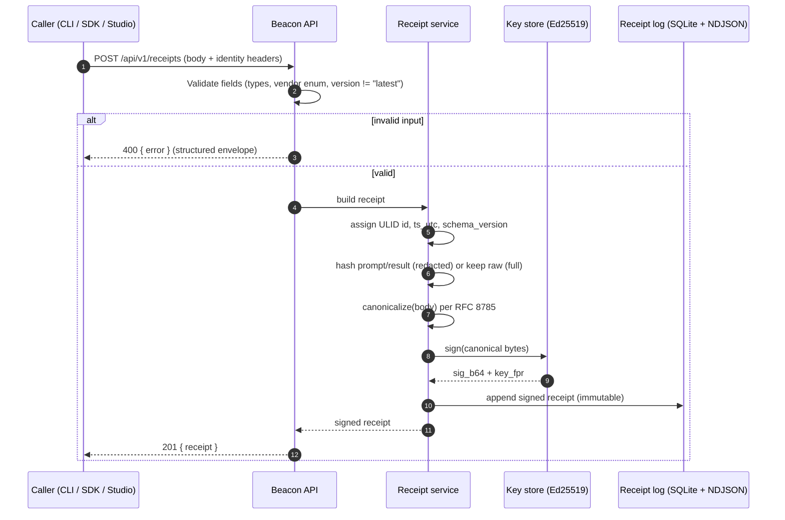
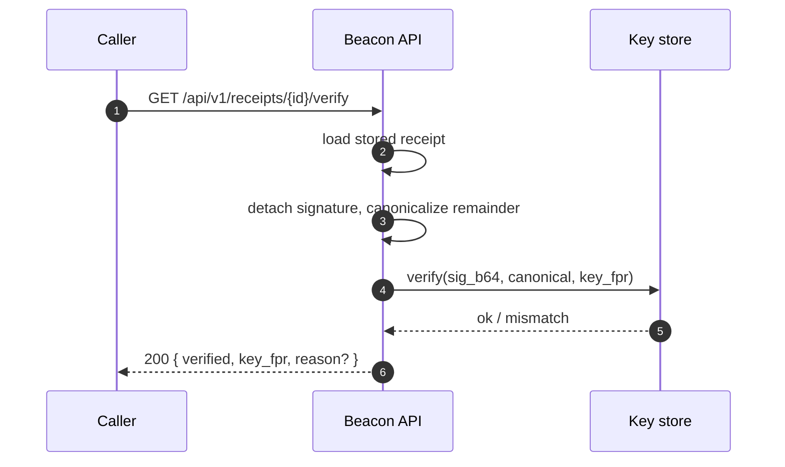
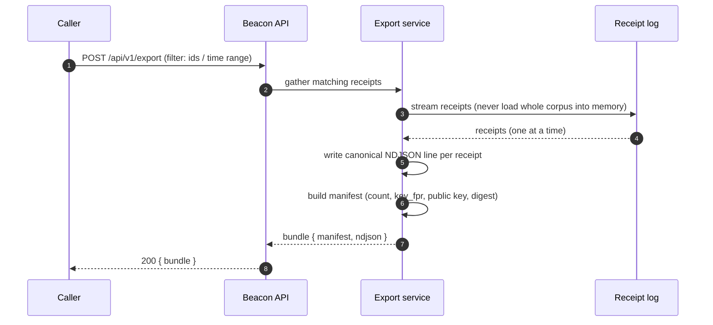
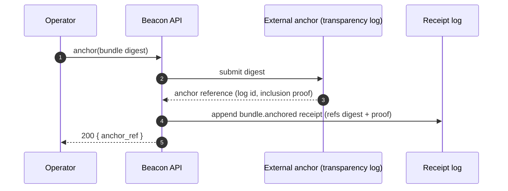
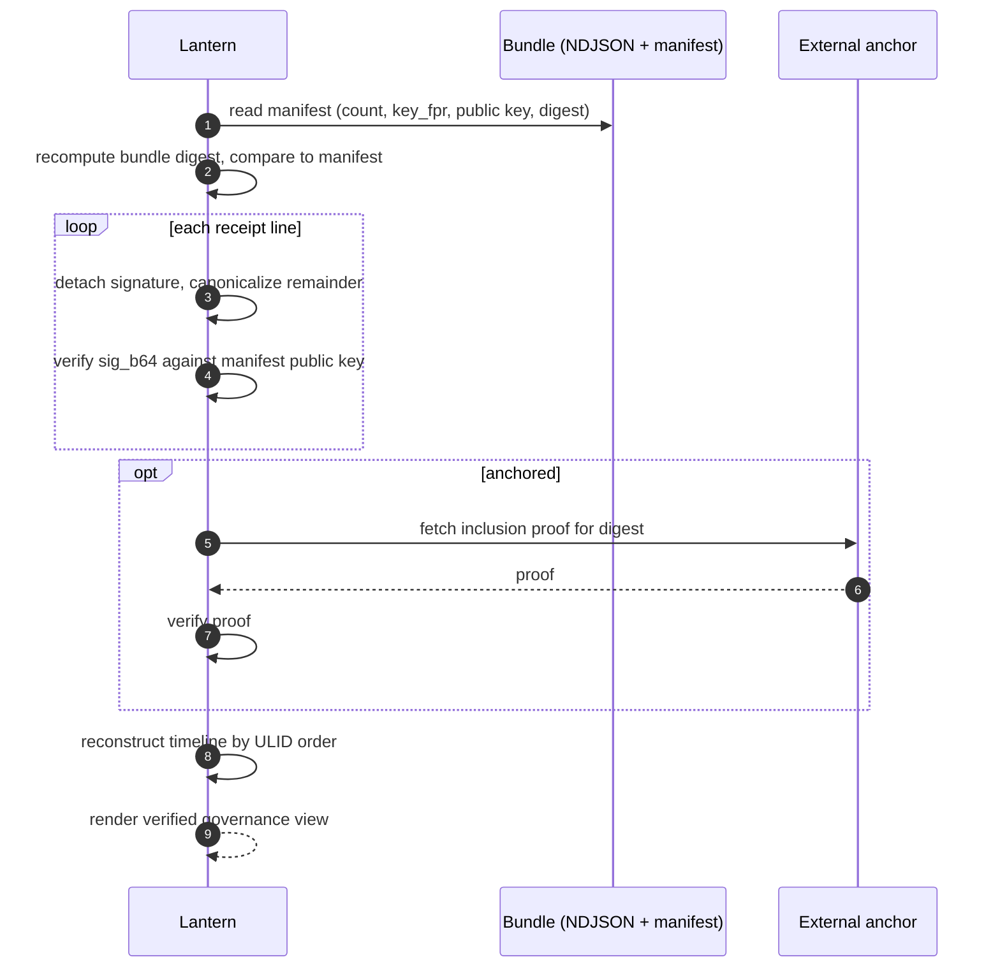
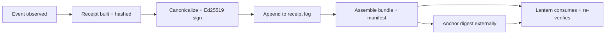

# Beacon Flows

How a receipt travels through Beacon — from the moment an event is observed to
the moment a downstream consumer (Lantern) reads it back and trusts it.

Each stage is small and inspectable. Together they form an unbroken,
cryptographically verifiable chain:

> **observe → build → sign → bundle → anchor → consume**

The API surface for each stage is defined in [`openapi.yaml`](./openapi.yaml).
The action verbs that ride inside receipts are catalogued in
[`actions.md`](./actions.md).

---

## 1. Receipt creation and signing

A receipt starts life as a plain object describing something that happened: a
model was discovered, a gate was evaluated, an inference was observed. Beacon
canonicalizes the body (RFC 8785 JCS), hashes any sensitive payloads instead of
storing them raw (in the default `redacted` capture mode), and signs the
canonical bytes with its Ed25519 key. The signature block is appended; the
receipt is now tamper-evident.

**Verification** is the mirror image: strip the `signature` block, canonicalize
the remaining body, and check `sig_b64` against the active public key.

---

## 2. Bundle assembly

A bundle is a portable, append-only collection of receipts — one NDJSON line
per receipt — plus a manifest that lists the included receipt ids and the public
key needed to verify them. Bundles are how evidence leaves Beacon as a single
self-contained artifact.

The bundle digest covers the manifest, so any change to the included receipts or
the key reference is detectable before a consumer even verifies individual
signatures.

---

## 3. Anchoring

Anchoring publishes the bundle digest to an external, harder-to-rewrite medium
(for example a transparency log or a timestamping authority). It does not move
the receipts themselves — only a commitment to their content — so anchoring is
cheap and leaks nothing. A `bundle.anchored` receipt records where the anchor
landed, closing the loop back into the receipt log.

Anchoring is optional. An un-anchored bundle is still fully verifiable against
the embedded public key; anchoring adds independent proof of *when* the bundle
existed.

---

## 4. Consumption by Lantern

Lantern is a downstream consumer that reads bundles and renders the governance
story they tell. It never has to trust Beacon's word: it re-verifies every
signature against the key in the manifest, and — if an anchor is present — checks
the inclusion proof against the external log.

Because receipt ids are ULIDs, Lantern can reconstruct an accurate chronological
timeline by sorting ids alone — no separate ordering metadata required.

---

## End-to-end at a glance

Every arrow above is verifiable after the fact: the signature proves *what*, the
ULID proves *when (order)*, the manifest proves *which set*, and the anchor
proves *no later than*.
